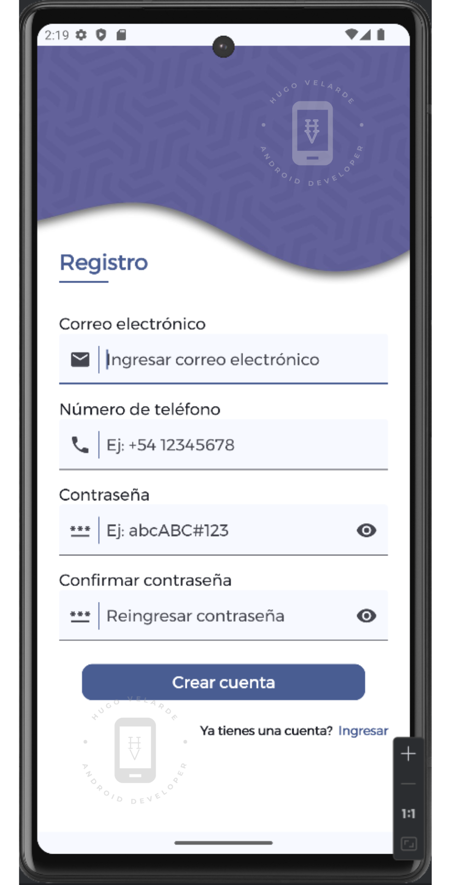

# PROYECTO UI DESIGN PARA OPTAR AL TRABAJO

Este proyecto de una aplicación móvil demostrativa tiene como fin verificar y evaluar las habilidades del desarollador para el diseño de interfaces gráficas para aplicaciones móviles.

Los requisitos esenciales para la aceptación y aprobación del proyecto a presentarse es que debe ser desarrollado completamente con lenguaje Kotlin y el kit de herramientas de desarrollo UI - Jetpack Compose. No se aceptarán proyectos desarrollados con lenguaje Java o Vistas XML.

Se tendrá 7 días de plazo para completar el proyecto a partir del momento en que tengan el enlace a este repositorio y deberán presentarlo como un repositorio de GitHub para la revisión y ejecución del código.

En este proyecto se busca evaluar las habilidades para el uso de control de versiones, conocimientos del lenguaje Kotlin, experiencia en el uso de Jetpack Compose, conocimientos de arquitectura y código limpio, uso de patrones de arquitectura.

Si bien el candidato tiene la libertad de desarrollar el proyecto de acuerdo a su ingenio e imaginación, debe ceñirse lo más posible al ejemplo del proyecto y replicar cada una de las funcionalidades del mismo, cada funcionalidad o característica que tiene el proyecto tienen la finalidad de evaluar conocimientos específicos de programación, realizar modificaciones muy notorias podría comprometer la calificación de la evaluación del proyecto. Sin embargo, se pueden añadir, mejorar o recomendar algunas características en nuevas ramas o como parte de la descripción del repositorio.

El repositorio debe contener imágenes, capturas o videos de la aplicación desarrollada para realizar el proyecto.

## DESCRIPCIÓN DEL PROYECTO

Esta descripción se debe utilizar para referencia de desarrollo de las pantallas de Acceso a la cuenta (Login) y Creación de cuenta (Signup).

### PANTALLA DE LOGIN

Esta pantalla debe contener mínimamente todos los elementos que se observan en las imágenes y el video, pueden realizarse mejoras y deben ser explicadas en el repositorio que creen para el proyecto.

Partes que componen la pantalla de Login:

1. Fondo de pantalla con un diseño, puede replicarse el fondo que se muestra o usar otro similar. La paleta de colores también puede ser modificable.
2. Título de pantalla, respetar el diseño, título y línea bajo el título. La fuente usada es Montserrat, pero hay libertad de usar cualquier otra fuente.
3. Nombre de campo o level, replicar el mismo diseño, si se desea se puede sugerir otro estilo.
4. Los campos deben incluir un icono que haga referencia a los datos a ingresarse, que estén separados por una línea de los datos que ingresará el usuario.
5. Los campos también deben contener un texto interno que describa el tipo de datos a ingresar como por ejemplo: Ingresar correo electrónico.
6. El campo de contraseña debe contener un icono adicional que además permita mostrar u ocultar la contraseña que el usuario está ingresando.
7. En el caso de que se introduzca algún dato erroneamente, que muestre un aviso de que los datos ingresados son incorrectos.
8. Como es una interface gráfica demostrativa debe contener mensajes o avisos emergentes para los elementos: caja de selección, enlace para recuperar contraseña, botón del formulario.
9. Finalmente el enlace de "Ingresar" debe llevar a la pantalla de Registro.

### PANTALLA DE SIGNUP

Esta pantalla debe contener mínimamente todos los elementos que se observan en las imágenes y el video, pueden realizarse mejoras y deben ser explicadas en el repositorio que creen para el proyecto.

Partes que componen la pantalla de Signup:

1. Fondo de pantalla con un diseño, puede replicarse el fondo que se muestra o usar otro similar. La paleta de colores también puede ser modificable.
2. Título de pantalla, respetar el diseño, título y línea bajo el título. La fuente usada es Montserrat, pero hay libertad de usar cualquier otra fuente que coincida con la pantalla de Login.
3. Nombre de campo o level, replicar el mismo diseño, si se desea se puede sugerir otro estilo.
4. Los campos deben incluir un icono que haga referencia a los datos a ingresarse, que estén separados por una línea de los datos que ingresará el usuario.
5. Los campos también deben contener un texto interno que describa el tipo de datos a ingresar como por ejemplo: Ingresar correo electrónico.
6. El campo de contraseña debe contener un icono adicional que además permita mostrar u ocultar la contraseña que el usuario está ingresando.
7. El campo de confirmación de contraseña debe verificar que la contraseña ingresada sea la misma que ingresó el usuario anteriormente.
8. En el caso de que se introduzca algún dato erroneamente, que muestre un aviso de que los datos ingresados son incorrectos.
9. Como es una interface gráfica demostrativa debe contener un mensaje o aviso emergente para el botón del formulario.
10. Finalmente el enlace de "Crear cuenta" debe llevar a la pantalla de Ingreso.

## PANTALLAS A OBTENER

 

## VIDEO DE DEMOSTRACIÓN

https://github.com/user-attachments/assets/8cbd28bd-78af-4a4b-82eb-60003a33e728

## PALABRAS FINALES

Estos proyectos se irán replicando cada tres meses, debido al crecimiento de nuestro nicho exclusivo de clientes, la demanda de desarrolladores especializados en Front End de aplicaciones de dispositivos móviles nos permite ir requiriendo cada cierto tiempo de más personas interesadas en trabajar con nosotros, por lo que los que no hayan sido seleccionados por alguna razón podrán presentarse nuevamente en la siguiente convocatoria.

Les deseamos suerte en el desarrollo del proyecto.

