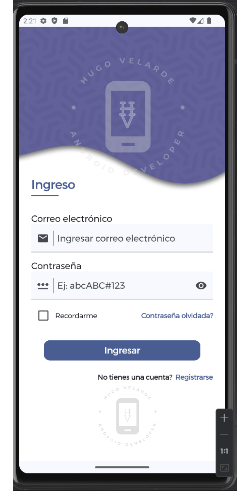

# PROYECTO UI DESIGN PARA OPTAR AL TRABAJO

Este proyecto de una aplicación móvil demostrativa tiene como fin verificar y evaluar las habilidades del desarollador para el diseño de interfaces gráficas para aplicaciones móviles.

Los requisitos esenciales para la aceptación y aprobación del proyecto a presentarse es que debe ser desarrollado completamente con lenguaje Kotlin y el kit de herramientas Jetpack Compose. No se aceptarán proyectos desarrollados con lenguaje Java.

## DESCRIPCIÓN DEL PROYECTO

Esta descripción se debe utilizar para referencia de desarrollo de las pantallas de Acceso a la cuenta y Creación de cuenta

### PANTALLA DE LOGIN

### PANTALLA DE SIGNUP

## PANTALLAS A OBTENER

 

## VIDEO DE DEMOSTRACIÓN

https://github.com/user-attachments/assets/8cbd28bd-78af-4a4b-82eb-60003a33e728

Demostración de las pantallas de Ingreso y Registro a una app móvil de Android, hecha en Android Studio con Kotlin y Jetpack Compose

